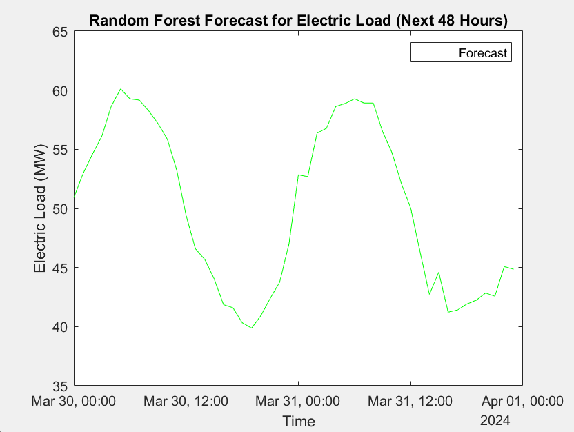
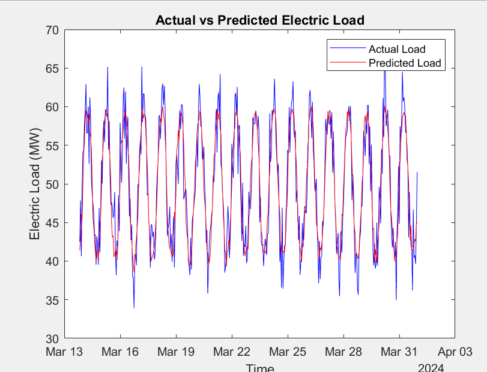
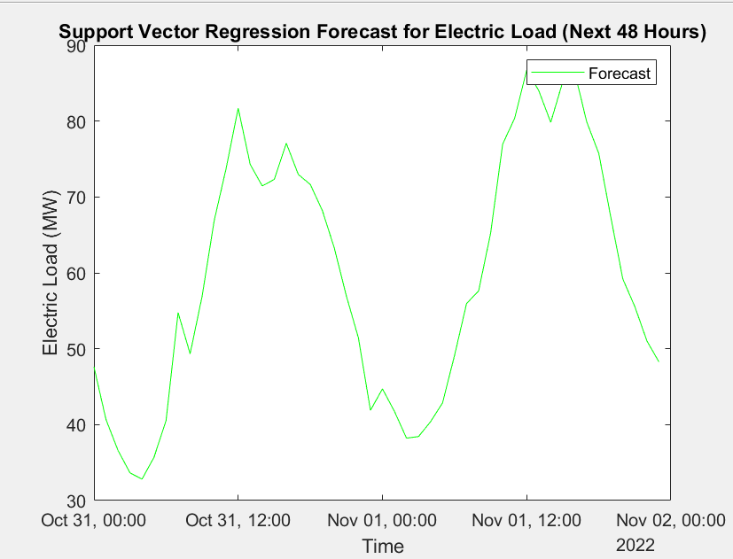
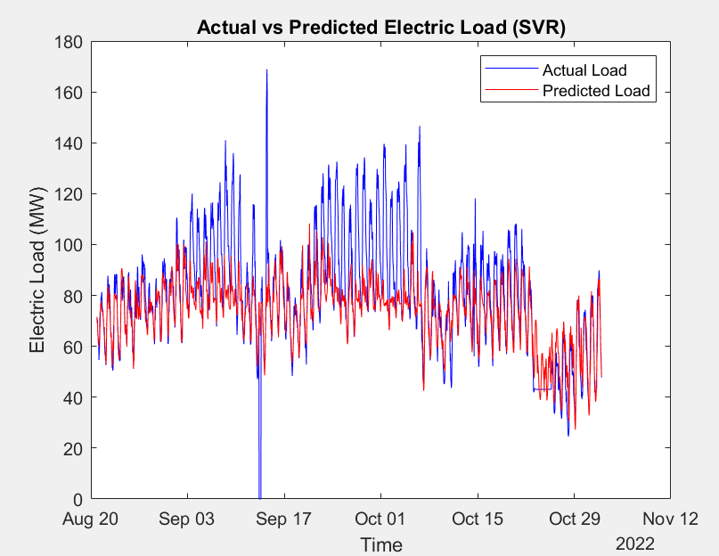
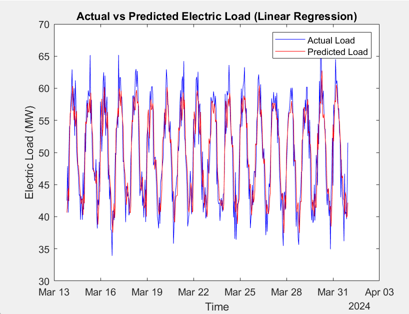

# load-forecasting-ml
Comparative Analysis of Random Forest, SVR, and Linear Regression for Load Forecasting using MATLAB

This project presents a comparative analysis of three machine learning models — **Random Forest**, **Support Vector Regression (SVR)**, and **Linear Regression** — for short-term electricity load forecasting in a solar-powered microgrid. The work is implemented in MATLAB and is based on real-world weather and load data.

> 📝 *This IEEE-style paper was written as part of my undergraduate research.*

---

## Problem Statement

Solar-powered microgrids are gaining popularity due to their clean and localized energy generation. However, the variability of solar energy introduces challenges in reliable energy forecasting. This project aims to:

- Accurately forecast short-term (48-hour) electric load demand
- Compare the prediction accuracy of multiple ML models
- Improve microgrid efficiency using data-driven methods

---

## Dataset

- Source: Public dataset from a solar power station ([Kaggle link](https://www.kaggle.com/datasets/itssaru/solar-power-generation-data))
- Features used:
  - Solar irradiance
  - Temperature
  - Dewpoint
  - Specific humidity
  - Wind speed
  - Hour of Day
  - Day of Week
  - Lagged electric load (previous 3 hours)

---

## Preprocessing

- Combined date/time columns into a single timestamp
- Filled missing values using previous observations
- Normalized feature columns
- Added lag features and time-based features

---

## Machine Learning Models

### 1. Linear Regression
- Fast and interpretable
- Used as a baseline for comparison

### 2. Support Vector Regression (SVR)
- Applied with RBF kernel
- Nonlinear modeling but sensitive to feature scaling and hyperparameters

### 3. Random Forest
- Ensemble of decision trees
- Best performance overall

---

## 📊 Evaluation Metrics

| Model            | RMSE     | R² Score |
|------------------|----------|----------|
| Linear Regression| 3.8415   | 0.73956  |
| SVR              | 16.5911  | 0.4733   |
| Random Forest    | 3.0002   | 0.84114  |

🎯 **Conclusion**: Random Forest provided the best forecasting performance in this study.

---

## 📈 Visual Results

### 🔹 Random Forest

**48-Hour Forecast:**



**Actual vs Predicted Load:**



---

### 🔹 Support Vector Regression (SVR)

**48-Hour Forecast:**



**Actual vs Predicted Load:**



---

### 🔹 Linear Regression

**Actual vs Predicted Load:**



---

## 🧪 How to Run the Project (in MATLAB)

1. Open MATLAB
2. Run the files in `/code`:
   - `loadforecasting_LR.m`
   - `loadforecasting_svr.m`
   - `loadforecasting_RF.m`
3. Results will be printed in the console and plots will appear

---

##  Repository Structure

```plaintext
/code
  ├── loadforecasting_LR.m
  ├── loadforecasting_svr.m
  └── loadforecasting_RF.m

/report
  └── load_forecasting_report.pdf

/results
  ├── rf_forecast_48hrs.png
  ├── rf_actual_vs_predicted.png
  ├── svr_forecast_48hrs.png
  ├── svr_actual_vs_predicted.png
  └── lr_actual_vs_predicted.png

README.md
